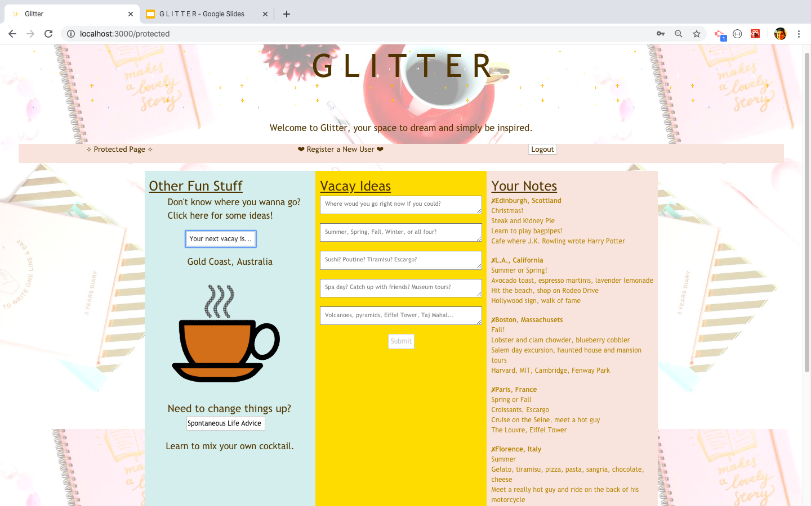
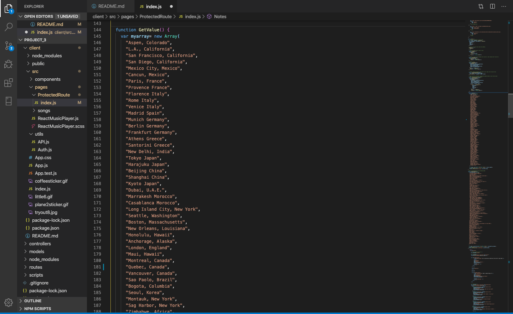
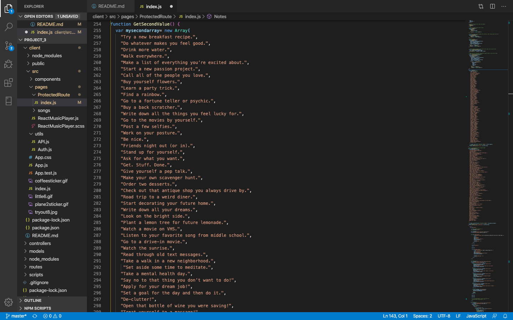
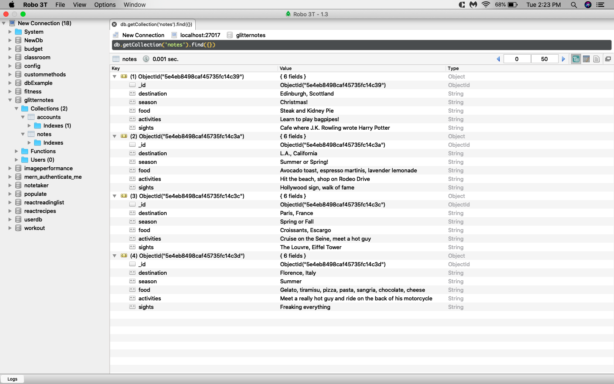

# GLITTER

Website: http://www.theglitterapp.com/
GitHub Pages: https://pmahalan.github.io/GLITTER/
GitHub Repo: https://github.com/pmahalan/GLITTER
Heroku: https://arcane-retreat-34096.herokuapp.com/

## Description/Elevator Pitch
GLITTER is a lifestyle application and notetaking dashboard. It utilizes React.js for the user-end, Mongo DB for the server-end, Express.js for routing, and numerous Node.js packages throughout. The utility of GLITTER lays in its simplicity of being a "chillout" zone for users. Its primary purpose is to provide users a space to type out their fondest ideas pertaining to travel, irrespective of how close to or far from reality those ideas are. Additionally, it has two "random-array" features aimed towards providing users with additional ideas, should they want new ideas for where to travel or ways to change up their day-to-day routines.

## Motivation/User Story:
AS A person with hopes for a fun life,

I WANT TO have a platform where I can daydream "out loud",

SO I CAN have my own, private outlet to edify "what could be".

----

"Never quit your day dream." - Anon.

"Nothing is impossible, the word itself says 'I'm possible'!" - Audrey Hepburn

"The future belongs to those who believe in the beauty of their dreams." - Elanor Roosevelt

## Responsibilities

#### Server-End
The server-end of GLITTER needed to consist of a database which stored user-created notes; I accomplished this through the use of Mongo DB (https://www.mongodb.com). I set up routing in my application which allows users to (1) create new notes (and post them to a specific section on the front-end of the application), (2) get existing notes from the database associated with their username (which are automatically loaded on the front-end upon their logging in), and (3) delete notes from the database collection associated with their username. Through the use of vanilla Javascript functions as well as React.js componentizing, I was able to create onClick events for note-loading, note-writing, and note-deleting which connected the server-side functionality to the user-end functionality.

#### User-End
The front-end of my application needed first-and-foremost to match the aesthetic and vibe of the space I was trying to create. I began by finding a desirable, open-source image to use as my page's background. After having selected my app's background image as well as a CSS library (https://bulma.io), I decided to utilize the proportional-column feature that Bulma offers. Applying the class name "column is-one-third" to each of the three main columns on the note page, I was able to have the three distinct columns currently being displayed on the main webpage. Through the use of color-pickers, I selected hexcode-specific shades to use for my column colors (and text colors) which compliment colors from the background image. In addition to my color and layout choices, I utilized open-source gifs from GIPHY (https://www.giphy.com) and the font 'Trebuchet MS' to gradually build my specific aesthetic.

In addition to the minimal front-end functionality of loading, deleting and creating notes, I wanted to incorporate some fun and "widget-like" features to provide entertainment and spontaneity. This was the inspiration behind my two favorite front-end features: the random arrays. The first random-array feature, at the top of the left-most column, generates a random potential vacation destination each time the user clicks on it. The second random-array, at the bottom of the same column, offers a random life suggestion each time the user clicks on it. Each of the two arrays contain 100 indeces; this provides for a wide selection of potential results for the user each time they click on either button!

New Technologies:
- Bulma CSS (https://bulma.io)
- React Music Player (https://www.npmjs.com/package/react-music-player)

Databases:
- Mongo DB (https://www.mongodb.com)

Database workbench:
- Robo 3T (https://www.robomongo.org/)

## Directions for Future Development

My main steps for future development would be to incorporate more "new" technologies (ones which I haven't previously used). One aspect of this application which I had intended to incorporate, but which hasn't worked to fruition, is the use of the NPM package "React Music Player" (https://www.npmjs.com/package/react-music-player). Had this worked as intended, there would've been a section on my application's front-end on which users could play music from a playlist of pre-determined songs. The instructions for correct usage of this NPM package, however, were unclear and poorly documented; as such, when I tried to incorporate various songs and then test them through the music player, they did not play. If this is not a well-supported NPM package, or if I develop this on a different platform altogether in the future (i.e. VUE.js or Angular), then I ultimately may not use this NPM package.

Other considerations for future development may include the use of a map API which would allow users to visualize various destinations on a map, search for destinations by name, or even search for activities and things to do at those locations. 

An additional aspect of potential future development is the inclusion of "realistic" things to reference, (i.e. Airbnb, Pinterest, Kayak, Hotwire...). I struggle with this, however, because the concept of my application is to be something aimed purely towards sparking inspiration, NOT to be something which pressures the user to necessarily book a vacation. (I want to strike a balance between helping the user bring their ideas to fruition, and making assumptions about their actual travel methods or what's feasible for them.) 

Similarly, I have thought about but struggled with the idea of incorporating a "few of my favorite things" section. This would be fitting for my website because of the fact that my "favorite things" which would make this list are inspiring and girly things which match the aesthetic of my application -- i.e. fancy Starbucks drinks, Alex and Ani bracelets, konMarie, ban.do stationary etc. However, this could easily turn into an inadvertent method of endorsing random businesses and companies, which I do not want to do (unless I'm being sponsored by them). I could alternatively allow the user to create their own "few of my favorite things" section, however, there are already other lifestyle apps out there for this purpose such as Pinterest.

## Screenshots

